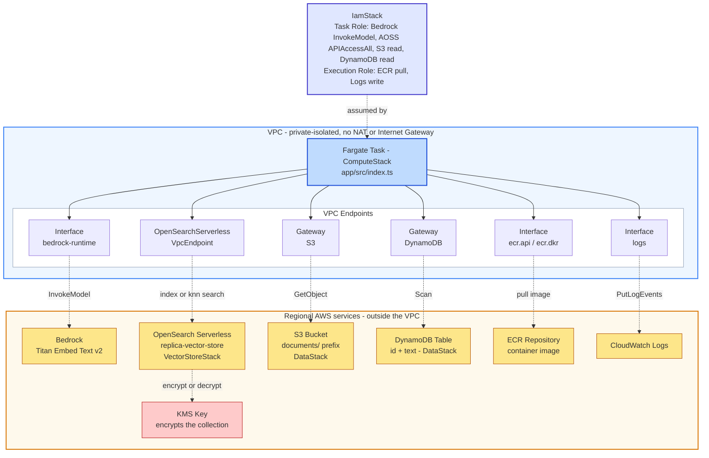

# bedrock-opensearch-replica

A standalone, minimal replica of the Bedrock → OpenSearch Serverless (AOSS)
connection pattern found in `pentesting-agentic-harness-infra`'s
`kg.ts`/`knowledge-graph-stack.ts`, plus the two upstream data-source
patterns (S3, DynamoDB) that feed it in the reference codebase —
deliberately without the surrounding platform (no ECS job orchestration
beyond a single on-demand task, no Neptune/graph side, no skills system).

**Nothing in this project has been deployed.** It's infrastructure + code
for you to review and deploy yourself.

## Production reference — exact names/shapes this replica mirrors

| | Production (`pentesting-agentic-harness-infra`) | This replica |
|---|---|---|
| DynamoDB table | `harness-findings` (partition key `findingId`) | Same name, same partition key — see `lib/config.ts` / `lib/data-stack.ts` |
| S3 source file | `jobs/{assetSlug}/FINDINGS_SUMMARY.json` (top-level `{findings: [...], fixUnits: [...], netraFailedCount}`) | Same path shape, same `findings` array extraction — see `app/src/s3-source.ts` |
| OpenSearch index | `harness-findings-kg` | `replica-findings-kg` — deliberately a different name so this demo collection is never mistaken for the real one |
| Index mapping | `embedding` (`knn_vector`, dim 1024, `hnsw`/`faiss`) + `findingId`/`title`/`severity`/`assetName`/`jobId`/`jobType`/`cwe`/`createdAt` | Identical field-for-field — see `app/src/opensearch.ts`'s `ensureIndex()` |
| `textForEmbedding` construction | `` `${title} ${severity} ${cwe ?? ""} ${assetName}`.slice(0, 2000) `` (`kg.ts:983-988`) | Identical — `app/src/embed.ts`'s `buildEmbeddingText()` |
| Idempotent re-index | `clearExistingEmbeddings(jobId)` — paginated `search_after` delete before every re-embed, since AOSS Serverless has no `_delete_by_query` (`kg.ts:315-372`) | Ported logic-for-logic — `app/src/opensearch.ts`'s `clearExistingEmbeddings()`, called once per `jobId` group in `app/src/index.ts` before that group's findings are (re-)embedded |

Deliberately **not** matched: retry/backoff on Bedrock calls, bulk-batching
writes in groups of 50, and S3/DynamoDB read pagination. Production's exact
values for those are documented in "What's intentionally left out" below,
so you know what to add before treating this as anything beyond a demo.

**Portability constraint (standing rule for this project):** this is meant
to run in environments that do **not** have access to GS-internal packages
or registries (e.g. `@cft/*`, `npm.aws.site.gs.com`). Every dependency here
resolves from the public npm registry — `aws-cdk-lib`, `constructs`, and
official `@aws-sdk/*` / `@opensearch-project/opensearch` packages only. If
you're extending this project, keep it that way: no `@cft/*` imports, no
private-registry-only packages, no dependency on tooling that only exists
inside the harness platform's own environment (SIF/SPIFFE auth, Skypath
proxy, the custom `AppStagingSynthesizer`/`CftCustomStagingStack` factory,
etc.) — those were all deliberately left out, not overlooked.

## Architecture

```
                              AWS ACCOUNT
  ┌────────────────────────────────────────────────────────────────────┐
  │  VPC — private-isolated (no NAT, no Internet Gateway)              │
  │                                                                    │
  │   ┌──────────────────────────┐                                     │
  │   │   Fargate Task           │   IamStack:                         │
  │   │   (ComputeStack)         │◄──  Task Role   → Bedrock, AOSS,    │
  │   │   app/src/index.ts       │       S3 read, DynamoDB read        │
  │   └───────────┬──────────────┘     Execution Role → ECR pull,      │
  │               │                       CloudWatch Logs write        │
  │   ┌───────────┴────────────────────────────────────────────┐       │
  │   │                    VPC Endpoints                       │       │
  │   │  Interface: bedrock-runtime │ AOSS VpcEndpoint         │       │
  │   │  Interface: ecr.api/dkr     │ Interface: logs          │       │
  │   │  Gateway:   S3              │ Gateway:   DynamoDB      │       │
  │   └──┬──────────┬──────────┬─────────┬──────────┬──────────┘       │
  └──────┼──────────┼──────────┼─────────┼──────────┼──────────────────┘
         │          │          │         │          │
         ▼          ▼          ▼         ▼          ▼
    ┌────────┐ ┌──────────┐ ┌──────┐ ┌─────────┐ ┌─────────────┐
    │Bedrock │ │  AOSS    │ │  S3  │ │DynamoDB │ │ ECR / Logs  │
    │(embed) │ │Collection│ │Bucket│ │  Table  │ │(image/logs) │
    └────────┘ └────┬─────┘ └──────┘ └─────────┘ └─────────────┘
                     │
                     ▼
                ┌─────────┐
                │ KMS Key │  ← AOSS calls this directly; the task never does
                └─────────┘
```

<details>
<summary>Mermaid source (for editing — renders correctly on GitHub/GitLab's web UI, which use a full browser-based renderer)</summary>



</details>

Solid arrows = network path within the VPC (Fargate task → its VPC endpoints).
Dashed arrows = what each endpoint actually reaches once traffic leaves the
VPC boundary. Nothing here ever touches the public internet — every hop is
either an interface endpoint (PrivateLink) or a gateway endpoint.

The one node with no arrow *from* the task: **KMS**. The task never calls
KMS directly — AOSS encrypts/decrypts the collection's data transparently,
on AWS's own backend, using the grant configured in `VectorStoreStack`.

### What each service is and how it connects

| Service | What it does here | How the task reaches it |
|---|---|---|
| **Fargate Task (ECS)** | The actual compute — runs `app/src/index.ts`, the only thing that's "live" when you invoke it. Everything else in this list is something *it* calls, on demand, once per run. | N/A — this *is* the caller |
| **Amazon Bedrock** | Converts document text into a 1024-dimension embedding vector (`amazon.titan-embed-text-v2:0`). Pure function-call shape: send text, get a vector back. Holds no state, stores nothing. | `bedrock-runtime` interface VPC endpoint, authorized by the task role's `bedrock:InvokeModel` permission |
| **OpenSearch Serverless (AOSS)** | The vector database — stores each embedding and answers "what's semantically similar to this?" via k-NN search. This is the actual destination the whole pipeline exists to feed. | A dedicated `AWS::OpenSearchServerless::VpcEndpoint` (not a standard interface endpoint — see the code comment in `network-stack.ts` for why), authorized by both the AOSS data-access policy (naming the task role) and the network policy (naming this specific endpoint) |
| **S3 Bucket** | One of two raw data sources — holds `FINDINGS_SUMMARY.json` files to embed, one per asset under a `jobs/{assetSlug}/` prefix (same shape as the reference codebase's real S3 layout). Read-only from the task's perspective. | S3 **gateway** endpoint (free, no ENI, just a routing-table entry), authorized by `bucket.grantRead(taskRole)` |
| **DynamoDB Table** | The second raw data source — the `harness-findings` table, scanned in full on every run for finding items (`findingId`, `title`, `severity`, `assetName`, `jobId`, `cwe`, `createdAt`). | DynamoDB **gateway** endpoint, authorized by `table.grantReadData(taskRole)` |
| **ECR Repository** | Hosts the container image the Fargate task actually runs. Only touched at task *launch*, not during the task's own logic. | `ecr.api` + `ecr.dkr` interface endpoints, authorized by the execution role's `AmazonECSTaskExecutionRolePolicy` |
| **CloudWatch Logs** | Receives every `console.log()` line the container prints — the only visibility you have into what a run actually did. | `logs` interface endpoint, authorized by the same execution-role managed policy as ECR |
| **KMS Key** | Encrypts the OpenSearch collection's data at rest. The *only* service in this list the Fargate task never calls directly — AOSS calls it on your behalf, on AWS's own infrastructure. | No task-side connection at all; authorized via a KMS Grant to the `aoss.amazonaws.com` service principal, configured in `VectorStoreStack` |
| **IAM (Task Role + Execution Role)** | Not a data-flow node — it's the permission layer every arrow above depends on. Task Role is what the running container's AWS SDK calls authenticate as; Execution Role is what ECS itself uses to launch the task (image pull, log setup) before your code even starts. | N/A — this is *how* every other connection is authorized, not a connection itself |

## What this is

- **`bin/app.ts`** + **`lib/*.ts`** — a 5-stack CDK app:
  1. `IamStack` — the Fargate task role (Bedrock + AOSS permissions) and
     execution role. Created first, deliberately, to avoid a circular
     dependency between `VectorStoreStack` and `ComputeStack` (see the
     comment at the top of `lib/iam-stack.ts`).
  2. `NetworkStack` — a VPC (no NAT/IGW — fully private) with interface VPC
     endpoints for `bedrock-runtime` and `aoss`, plus **gateway** endpoints
     for S3 and DynamoDB (free, and the only way a fully-isolated subnet
     can reach those two services without a NAT gateway).
  3. `VectorStoreStack` — the OpenSearch Serverless collection
     (`Type: VECTORSEARCH`) plus its three required policies (encryption,
     network, data access).
  4. `DataStack` — the two **data entry points**: an S3 bucket
     (`FINDINGS_SUMMARY.json` files under a `jobs/{assetSlug}/` prefix) and
     a DynamoDB table (`harness-findings` — `findingId` partition key, plus
     `title`/`severity`/`assetName`/`jobId`/`cwe`/`createdAt`, scanned in
     full). Standalone — no dependency on the other stacks; the task role is
     granted least-privilege read access to both via `bucket.grantRead()`/
     `table.grantReadData()` in `bin/app.ts`, after both `IamStack` and
     `DataStack` exist.
  5. `ComputeStack` — an ECS cluster and a single Fargate task definition
     for the connector container. **Not** a running Service and **not**
     wired to any scheduler — meant to be invoked on demand.
- **`app/`** — the connector code that runs inside the Fargate container:
  reads every finding from S3 + DynamoDB, groups them by `jobId`, clears any
  existing embeddings for each `jobId` (idempotent re-index), embeds each
  finding via Bedrock, writes each to OpenSearch, then runs one k-NN search
  as a smoke test. Falls back to a single hardcoded sample finding if both
  sources are empty, so the container is still runnable with zero data
  seeded.

### Config vs. logic

`lib/config.ts` holds **every tunable value** — resource names (collection,
bucket, cluster, log group, the 3 AOSS policy names), sizing (VPC AZ count,
task CPU/memory, log retention), and the embedding model ID/dimension. It's
plain data, deliberately kept free of resource-creation code.

Every stack file (`iam-stack.ts`, `network-stack.ts`, `vector-store-stack.ts`,
`data-stack.ts`, `compute-stack.ts`) imports from `config.ts` and contains
only *logic* — which AWS resources to create and how they connect. None of
them hardcode a name, size, or model ID inline anymore.

**To retune anything — a name, a size, the embedding model — edit
`lib/config.ts` only.** No stack file should ever need touching just to
change a value. The one exception, documented in `config.ts` itself, is
`compute.logRetention`: it's a `logs.RetentionDays` enum value rather than a
plain number, because that enum only accepts a fixed set of values (there's
no arbitrary "retain for N days" option in CDK).

The embedding dimension (`vectorStore.embeddingDimension`, default `1024`)
flows all the way through to the running container via an `EMBEDDING_DIMENSION`
env var, so `app/src/opensearch.ts`'s index schema and the actual CDK config
can never drift out of sync with each other.

## What's intentionally left out (see the plan this was built from)

- No Neptune / graph relationships — Bedrock↔OpenSearch(+S3/DynamoDB as
  data sources) only.
- No retry/backoff hardening in `app/src/embed.ts` beyond a TODO comment —
  the reference `kg.ts` has a 25s timeout + 5-attempt exponential backoff
  (base 1000ms, doubling, capped at 30s, plus 0-500ms jitter), retried only
  on `ThrottlingException`/`ServiceUnavailableException`; add that before
  any real production use.
- No bulk-batching on OpenSearch writes — `app/src/opensearch.ts`'s
  `indexDocument()` indexes one document per call. The reference `kg.ts`
  batches 50 documents per `bulk` request (`OPENSEARCH_BULK_SIZE`) with the
  same per-chunk retry/backoff as above (max 4 attempts, capped at 15s);
  worth adding if you seed this with more than a handful of findings.
- No pagination in `s3-source.ts` (single `ListObjectsV2` call) or
  `dynamodb-source.ts` (single `Scan` call) — fine for a demo, not for a
  large dataset. The reference `backfill_kg.py`/`rededup_main.py` handle
  pagination properly for real volume.
- No scheduled trigger for the ECS task — run it manually via
  `aws ecs run-task` (see below).
- No ECR repository or image push — `lib/compute-stack.ts`'s container
  image is a placeholder (`REPLACE_ME/...`) you need to swap for a real
  image reference before this can actually deploy and run.

**What *is* now implemented, matching production logic-for-logic:**
idempotent re-indexing via `clearExistingEmbeddings(jobId)` in
`app/src/opensearch.ts`. AOSS Serverless has no `_delete_by_query`, so
before (re-)embedding a given `jobId`'s findings, the connector paginates
through that `jobId`'s existing docs via `search_after` (1000 per page) and
bulk-deletes them, retrying each delete page up to 4 times
(exponential-backoff-plus-jitter) and skipping (non-fatal) a page that still
fails — the exact mechanism `kg.ts:315-372` uses, ported logic-for-logic.
Without this, re-running the connector against the same source data would
create duplicate vectors on every run.

## Seeding test data

Before running the connector, put something in S3 and/or DynamoDB for it to
find (optional — it'll fall back to a hardcoded sample finding if you skip
this).

**Exact resource names:** the DynamoDB table name is fixed and known in
advance — `harness-findings` (set in `lib/config.ts`,
`data.documentsTableName` — same name as production's real table). The S3
bucket name is **not** fixed (S3 names must be globally unique across every
AWS account, so it's deliberately left auto-generated to avoid a naming
collision at deploy time) — find the actual generated name from either
`cdk deploy`'s printed output or:
```bash
aws cloudformation describe-stacks --stack-name DataStack \
  --query "Stacks[0].Outputs"
```

```bash
# S3 — a FINDINGS_SUMMARY.json per asset, under jobs/{assetSlug}/ (replace
# <bucket-name> with the DocumentsBucketNameOutput value from the command
# above). Top-level shape matches production: {"findings": [...]}.
cat <<'EOF' | aws s3 cp - "s3://<bucket-name>/jobs/example-asset/FINDINGS_SUMMARY.json"
{
  "findings": [
    {
      "findingId": "example-1",
      "title": "Hardcoded credentials found in config.yaml",
      "severity": "high",
      "assetName": "example-asset",
      "jobId": "job-001",
      "cwe": "CWE-798"
    }
  ]
}
EOF

# DynamoDB — one item per finding, must have `findingId`, `title`, `severity`.
# Table name is fixed — no lookup needed.
aws dynamodb put-item \
  --table-name harness-findings \
  --item '{
    "findingId": {"S": "example-2"},
    "title": {"S": "Outdated TLS version enabled on the load balancer"},
    "severity": {"S": "medium"},
    "assetName": {"S": "example-asset"},
    "jobId": {"S": "job-001"},
    "cwe": {"S": "CWE-326"}
  }'
```

## Deploying it yourself

1. **Build and push the container image** to an ECR repo of your choosing:
   ```bash
   cd app
   npm install
   docker build -t bedrock-opensearch-connector .
   # tag + push to your ECR repo, then update lib/compute-stack.ts's
   # ecs.ContainerImage.fromRegistry(...) call to point at it
   # (or switch to ecs.ContainerImage.fromAsset("../app") to have CDK
   # build and push it for you automatically on `cdk deploy`).
   ```
2. **Install CDK dependencies and deploy the infrastructure:**
   ```bash
   npm install
   npx cdk synth        # sanity check — should synthesize all 5 stacks with no errors
   npx cdk deploy --all # requires AWS credentials + a bootstrapped account/region
   ```
3. **Enable model access for the embedding model** (`amazon.titan-embed-text-v2:0`
   by default) in the Bedrock console for your target region, if you haven't
   already — this is an account-level setting outside of CDK's control.
4. **Run the connector once:**
   ```bash
   aws ecs run-task \
     --cluster bedrock-opensearch-replica \
     --task-definition <ComputeStack's task def ARN, from the CDK deploy output> \
     --launch-type FARGATE \
     --network-configuration "awsvpcConfiguration={subnets=[<private subnet id>],securityGroups=[<compute SG id>],assignPublicIp=DISABLED}"
   ```
   Override the sample text with `--overrides` if you want to embed
   something other than the built-in placeholder string.
5. **Check the result:**
   - CloudWatch Logs, log group `/bedrock-opensearch-replica/connector` —
     should show the embedding dimension count and a k-NN search result
     printed at the end.
   - Or query the collection directly (same `knnSearch()`/index name
     `replica-findings-kg`) from any signed client if you want to inspect it
     outside of the container's own smoke test.

## Reference material this was built from

Everything here mirrors verified, code-read patterns from
`pentesting-agentic-harness-infra` — specifically `lib/knowledge-graph-stack.ts`,
`lib/iam-stack.ts`, `containers/runner-core/src/kg.ts`,
`skills-and-assets/skills/backfill-data/backfill_kg.py` (the S3 canonical-prefix
read pattern), and `skills-and-assets/skills/aggressive-dedup/rededup_main.py`
(the DynamoDB full-table-scan pattern) — not assumed or guessed. See
`/home/developer/opensearch-current-usage-technical.md`,
`/home/developer/bedrock-invokemodel-usage-inventory.md`, and
`/home/developer/opensearch-data-sources-and-consumers.md` for the full
research this replica is based on.

The `harness-findings`/`FINDINGS_SUMMARY.json` schema match, the
`textForEmbedding` construction, the OpenSearch document/index field
mapping, and the `clearExistingEmbeddings` idempotent-reindex logic were
added in a later pass, sourced from a direct read of `kg.ts:83-104`
(`parseFindings`), `kg.ts:195-209` (`ensureOpenSearchIndex` mapping),
`kg.ts:983-1000` (`textForEmbedding` + per-finding document shape), and
`kg.ts:315-372` (`clearExistingEmbeddings`) in that repo.
