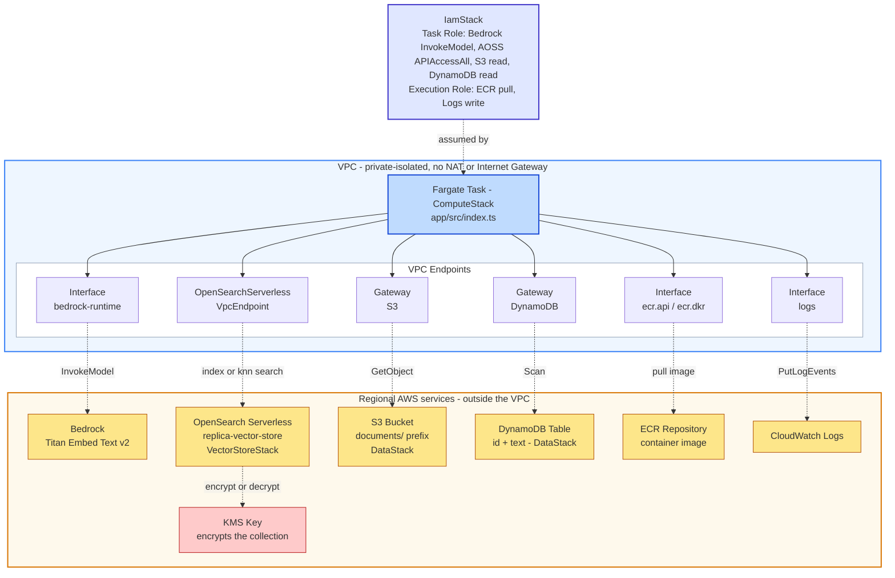

# bedrock-opensearch-replica

A small, standalone project for experimenting with the general shape of a
Bedrock → OpenSearch Serverless (AOSS) connector — embed text via Bedrock,
index it into AOSS, backed by S3/DynamoDB as data sources. It's loosely
inspired by patterns used in `pentesting-agentic-harness-infra`, but this
is **not** an exact copy or port of that codebase: it's a from-scratch
implementation, built to learn/experiment with this connection pattern in
isolation, deliberately without the surrounding platform (no ECS job
orchestration beyond a single on-demand task, no Neptune/graph side, no
skills system, no internal auth/tooling).

What started as that small connector has since grown two additions,
layered on top rather than replacing it: a **side-by-side evaluation
dashboard** (`dashboard/`) for comparing Classic vs NextGen OpenSearch
Serverless collections, and a throwaway **NextGen comparison collection**
(`NextGenVectorStoreStack`) it queries against. See "Beyond the core
connector" below for both.

**Nothing in this project has been deployed.** It's infrastructure + code
for you to review and deploy yourself.

**Portability constraint (standing rule for this project):** this is meant
to run in environments that do **not** have access to GS-internal packages
or registries (e.g. `@cft/*`, `npm.aws.site.gs.com`). Every dependency here
resolves from the public npm registry — `aws-cdk-lib`, `constructs`, and
official `@aws-sdk/*` / `@opensearch-project/opensearch` packages only. If
you're extending this project, keep it that way: no `@cft/*` imports, no
private-registry-only packages, no dependency on tooling that only exists
inside the harness platform's own environment (SIF/SPIFFE auth, Skypath
proxy, the custom `AppStagingSynthesizer`/`CftCustomStagingStack` factory,
etc.) — those were all deliberately left out, not overlooked.

## Architecture

The diagram and table below are deliberately scoped to `ComputeStack`'s own
connector task — the minimal core this replica started as. For the complete
picture (all 8 stacks, `DashboardStack`/`BastionStack`/`NextGenVectorStoreStack`,
and the ASE-only control-plane endpoint), see
**[`docs/architecture-diagram.md`](docs/architecture-diagram.md)** (mermaid,
renders on GitHub/GitLab) or its
[published visual version](https://claude.ai/code/artifact/710a3208-693a-462d-b303-cec7deec7496).

```
                              AWS ACCOUNT
  ┌────────────────────────────────────────────────────────────────────┐
  │  VPC — private-isolated (no NAT, no Internet Gateway)              │
  │                                                                    │
  │   ┌──────────────────────────┐                                     │
  │   │   Fargate Task           │   IamStack:                         │
  │   │   (ComputeStack)         │◄──  Task Role   → Bedrock, AOSS,    │
  │   │   app/src/index.ts       │       S3 read, DynamoDB read        │
  │   └───────────┬──────────────┘     Execution Role → ECR pull,      │
  │               │                       CloudWatch Logs write        │
  │   ┌───────────┴────────────────────────────────────────────┐       │
  │   │                    VPC Endpoints                       │       │
  │   │  Interface: bedrock-runtime │ AOSS VpcEndpoint         │       │
  │   │  Interface: ecr.api/dkr     │ Interface: logs          │       │
  │   │  Gateway:   S3              │ Gateway:   DynamoDB      │       │
  │   └──┬──────────┬──────────┬─────────┬──────────┬──────────┘       │
  └──────┼──────────┼──────────┼─────────┼──────────┼──────────────────┘
         │          │          │         │          │
         ▼          ▼          ▼         ▼          ▼
    ┌────────┐ ┌──────────┐ ┌──────┐ ┌─────────┐ ┌─────────────┐
    │Bedrock │ │  AOSS    │ │  S3  │ │DynamoDB │ │ ECR / Logs  │
    │(embed) │ │Collection│ │Bucket│ │  Table  │ │(image/logs) │
    └────────┘ └────┬─────┘ └──────┘ └─────────┘ └─────────────┘
                     │
                     ▼
                ┌─────────┐
                │ KMS Key │  ← AOSS calls this directly; the task never does
                └─────────┘
```

<details>
<summary>Mermaid source (for editing — renders correctly on GitHub/GitLab's web UI, which use a full browser-based renderer)</summary>



</details>

Solid arrows = network path within the VPC (Fargate task → its VPC endpoints).
Dashed arrows = what each endpoint actually reaches once traffic leaves the
VPC boundary. Nothing here ever touches the public internet — every hop is
either an interface endpoint (PrivateLink) or a gateway endpoint.

The one node with no arrow *from* the task: **KMS**. The task never calls
KMS directly — AOSS encrypts/decrypts the collection's data transparently,
on AWS's own backend, using the grant configured in `VectorStoreStack`.

### What each service is and how it connects

| Service | What it does here | How the task reaches it |
|---|---|---|
| **Fargate Task (ECS)** | The actual compute — runs `app/src/index.ts`, the only thing that's "live" when you invoke it. Everything else in this list is something *it* calls, on demand, once per run. | N/A — this *is* the caller |
| **Amazon Bedrock** | Converts document text into a 1024-dimension embedding vector (`amazon.titan-embed-text-v2:0`). Pure function-call shape: send text, get a vector back. Holds no state, stores nothing. | `bedrock-runtime` interface VPC endpoint, authorized by the task role's `bedrock:InvokeModel` permission |
| **OpenSearch Serverless (AOSS)** | The vector database — stores each embedding and answers "what's semantically similar to this?" via k-NN search. This is the actual destination the whole pipeline exists to feed. | A dedicated `AWS::OpenSearchServerless::VpcEndpoint` (not a standard interface endpoint — see the code comment in `network-stack.ts` for why), authorized by both the AOSS data-access policy (naming the task role) and the network policy (naming this specific endpoint) |
| **S3 Bucket** | One of two raw data sources — holds `FINDINGS_SUMMARY.json` files to embed, one per asset under a `jobs/{assetSlug}/` prefix (same shape as the reference codebase's real S3 layout). Read-only from the task's perspective. | S3 **gateway** endpoint (free, no ENI, just a routing-table entry), authorized by `bucket.grantRead(taskRole)` |
| **DynamoDB Table** | The second raw data source — the `harness-findings` table, scanned in full on every run for finding items (`findingId`, `title`, `severity`, `assetName`, `jobId`, `cwe`, `createdAt`). | DynamoDB **gateway** endpoint, authorized by `table.grantReadData(taskRole)` |
| **ECR Repository** | Hosts the container image the Fargate task actually runs. Only touched at task *launch*, not during the task's own logic. | `ecr.api` + `ecr.dkr` interface endpoints, authorized by the execution role's `AmazonECSTaskExecutionRolePolicy` |
| **CloudWatch Logs** | Receives every `console.log()` line the container prints — the only visibility you have into what a run actually did. | `logs` interface endpoint, authorized by the same execution-role managed policy as ECR |
| **KMS Key** | Encrypts the OpenSearch collection's data at rest. The *only* service in this list the Fargate task never calls directly — AOSS calls it on your behalf, on AWS's own infrastructure. | No task-side connection at all; authorized via a resource policy statement granting both `aoss.amazonaws.com` and `es.amazonaws.com` (the second added for the dashboard's ASE ML pipeline, which runs on the same underlying service `es.amazonaws.com` represents), configured in `VectorStoreStack`. `NextGenVectorStoreStack` now provisions its own separate customer-managed key with the identical grant — KMS usage is no longer Classic-only |
| **IAM (Task Role + Execution Role)** | Not a data-flow node — it's the permission layer every arrow above depends on. Task Role is what the running container's AWS SDK calls authenticate as; Execution Role is what ECS itself uses to launch the task (image pull, log setup) before your code even starts. | N/A — this is *how* every other connection is authorized, not a connection itself |

Beyond what's drawn above, `NetworkStack` provisions four more interface
endpoints (`ssm`/`ssmmessages`/`ec2messages`) plus a second AOSS interface
endpoint for the **NextGen** collection, plus a third, separate AOSS
**control-plane** interface endpoint (`com.amazonaws.<region>.aoss`, distinct
from the data-plane `.aoss-data` endpoint — AZ-restricted to a single AZ,
see the comment in `network-stack.ts`). The first three exist for
`DashboardStack`'s ECS Exec support and `BastionStack`'s SSM port-forwarding;
the control-plane endpoint exists for the dashboard's ASE (Automatic
Semantic Enrichment) feature, which calls `CreateIndex`/`GetIndex` against
that API. None of these are used by the connector. See "Beyond the core
connector" below for what those two stacks (plus `NextGenVectorStoreStack`)
add.

## What this is

### Repository layout

```
bin/app.ts                       CDK entrypoint — wires all 8 stacks + their addDependency() order
lib/                              one file per stack, plus config.ts (see "Config vs. logic" below)
├── config.ts                     every tunable value — names, sizing, model ID/dimension
├── iam-stack.ts                  task/execution roles + both CloudWatch log groups
├── network-stack.ts              VPC + every VPC endpoint (bedrock, AOSS ×3, ecr, logs, ssm, S3/DDB gateways)
├── vector-store-stack.ts         Classic AOSS collection — what app/ actually reads/writes
├── data-stack.ts                 S3 bucket + DynamoDB table (the two data entry points)
├── compute-stack.ts              ECS cluster + on-demand Fargate task def for app/
├── nextgen-vector-store-stack.ts NextGen AOSS collection — the dashboard's comparison target
├── dashboard-stack.ts            always-on Fargate service + internal ALB for dashboard/
└── bastion-stack.ts              SSM-only EC2 — the only way to reach the dashboard's ALB

app/                              the core connector container (ComputeStack's task)
└── src/
    ├── index.ts                  default entrypoint — read → embed → index → smoke-test search
    ├── embed.ts, opensearch.ts, s3-source.ts, dynamodb-source.ts
    ├── seed.ts                    npm run seed — synthetic findings into S3/DynamoDB
    ├── query.ts                   npm run query — ad hoc embed + k-NN search
    └── seed-and-ingest.ts         chains both; ingest half currently DEFERRED (see file header)

dashboard/                        the evaluation dashboard container (DashboardStack's service)
├── README.md                     dashboard-specific architecture, API surface, security notes
├── src/
│   ├── server.ts                 Express app — /api/health, /api/seed(+/status), /api/compare(-ase)
│   ├── opensearch.ts             CollectionClient — keyword/vector/hybrid/ASE against one collection
│   └── embed.ts, seed.ts
├── public/                       hand-written frontend, served as-is (not compiled from TS)
│   ├── index.html
│   └── app.js
└── benchmark/                    NOT deployed — run manually against a live dashboard (see below)
    ├── queries.ts                 the labeled query set
    ├── run-benchmark.ts           scores dense/ASE/hybrid/keyword per the plan doc below
    └── results/                   saved output of the most recent run (report.md + results.json)

docs/                              research, POC results, and forward-looking proposals (not
                                   live infrastructure) — see docs/README.md for the full index
├── README.md                      index + status of everything below
├── comparison.md                  AOSS vs Vertex vs Vespa bake-off + the ASE deep dive/migration plan
├── architecture-diagram.md/.html  the full 8-stack system map (mermaid + designed/visual version)
├── poc-report.md/.html            live Classic-vs-NextGen POC test results
├── embedding-model-research.md    the evidence behind "Titan isn't proven best"
├── alternative-platforms-research.md
├── embedding-migration-plan.md
└── sparse-vs-dense-benchmark-plan.md  methodology dashboard/benchmark/ implements
```

- **`bin/app.ts`** + **`lib/*.ts`** — an 8-stack CDK app, instantiated in
  this order (each `addDependency()` call in `bin/app.ts` encodes a real
  ordering constraint, not just documentation):
  1. `IamStack` — the Fargate task role (Bedrock + AOSS permissions) and
     execution role, **plus both connector and dashboard CloudWatch log
     groups** (kept here, not in `ComputeStack`/`DashboardStack`, purely to
     avoid a circular dependency — see the comment at the top of
     `lib/iam-stack.ts`). Created first, deliberately, so `VectorStoreStack`
     and `ComputeStack` never need each other's outputs directly.
  2. `NetworkStack` — a VPC (no NAT/IGW — fully private) with interface VPC
     endpoints for `bedrock-runtime`, the AOSS **Classic** collection
     (`AWS::OpenSearchServerless::VpcEndpoint`), the AOSS **NextGen**
     collection (a separate, standard interface endpoint — NextGen resolves
     on a different domain than Classic), `ecr.api`/`ecr.dkr`, CloudWatch
     Logs, and `ssm`/`ssmmessages`/`ec2messages` (for ECS Exec + the
     bastion's SSM port-forwarding); plus **gateway** endpoints for S3 and
     DynamoDB (free, and the only way a fully-isolated subnet can reach
     those two services without a NAT gateway).
  3. `VectorStoreStack` — the **Classic** OpenSearch Serverless collection
     (`Type: VECTORSEARCH`) plus its three required policies (encryption,
     network, data access) — this is the collection the core connector
     (`app/`) actually reads/writes.
  4. `DataStack` — the two **data entry points**: an S3 bucket
     (`FINDINGS_SUMMARY.json` files under a `jobs/{assetSlug}/` prefix) and
     a DynamoDB table (`harness-findings` — `findingId` partition key, plus
     `title`/`severity`/`assetName`/`jobId`/`cwe`/`createdAt`, scanned in
     full). Standalone — no dependency on the other stacks; the task role is
     granted least-privilege **read and write** access to both via
     `bucket.grantRead()`/`grantWrite()` and `table.grantReadData()`/
     `grantWriteData()` in `bin/app.ts`, after both `IamStack` and
     `DataStack` exist. (Write access was added for the dashboard's seed
     job below — the connector itself only ever reads.)
  5. `ComputeStack` — an ECS cluster and a single Fargate task definition
     for the connector container, built straight from `app/` via
     `ecs.ContainerImage.fromAsset()` (CDK builds the Docker image and
     pushes it to a CDK-managed bootstrap ECR repo automatically on every
     `cdk deploy` — no manual ECR repo or `docker push` step). **Not** a
     running Service and **not** wired to any scheduler — meant to be
     invoked on demand.
  6. `NextGenVectorStoreStack` — a second, standalone OpenSearch Serverless
     collection on the **NextGen** generation, for the Classic-vs-NextGen
     comparison the dashboard runs. See "Beyond the core connector" below.
  7. `DashboardStack` — the evaluation dashboard's own ECS Fargate
     **service** (long-running, unlike `ComputeStack`) behind an internal
     ALB. See "Beyond the core connector" below.
  8. `BastionStack` — a single SSM-managed EC2 instance with no other
     purpose, so a laptop can reach the internal-only dashboard ALB. See
     "Beyond the core connector" below.
- **`app/`** — the connector code that runs inside `ComputeStack`'s
  container: reads every finding from S3 + DynamoDB, groups them by
  `jobId`, clears any existing embeddings for each `jobId` (idempotent
  re-index), embeds each finding via Bedrock, writes each to OpenSearch,
  then runs one k-NN search as a smoke test. Falls back to a single
  hardcoded sample finding if both sources are empty, so the container is
  still runnable with zero data seeded. Two extra standalone entrypoints
  live alongside `index.ts` (not run by it, and not `ComputeStack`'s
  default `CMD`): `seed.ts` (populate S3/DynamoDB with ~dozens of synthetic
  findings — `npm run seed`) and `query.ts` (embed an ad hoc
  `QUERY_TEXT` and run a k-NN search against it — `npm run query`,
  or via an `ecs run-task` command override). `seed-and-ingest.ts` chains
  seeding into ingestion in one process, though the ingest half is
  currently commented out (see the `DEFERRED` note at the top of that
  file).

### Beyond the core connector: dashboard, NextGen comparison, bastion

Three pieces that sit alongside the core connector rather than inside it —
each is optional to deploy/understand if you only care about the Bedrock↔
OpenSearch connector pattern itself, but they're real, deployed
infrastructure now, not just planning docs:

- **`dashboard/`** (`DashboardStack`) — a persistent Express app running as
  an ECS Fargate *service* (not a one-off task) behind an internal
  (`internetFacing: false`) ALB, reachable only from inside the VPC. Given
  a query, it runs keyword (BM25), vector (k-NN, Bedrock/Titan dense),
  hybrid, and **ASE** (Automatic Semantic Enrichment — AOSS's own
  service-managed sparse embedding, no Bedrock call) search against *both*
  the Classic collection (`VectorStoreStack`) and the NextGen collection
  (`NextGenVectorStoreStack`) simultaneously, and renders all eight result
  sets (2 collections × 4 modes) side by side. Which collections can
  actually provision an ASE index was an open question AWS's own docs don't
  confirm — `CollectionClient.ensureAseIndex()` discovers it live per
  collection rather than assuming both behave the same, and the UI shows
  "not available" rather than failing if a tier rejects it. As of the most
  recent benchmark run (`dashboard/benchmark/`), that turned out asymmetric
  in the opposite direction from what was originally suspected: **NextGen's
  ASE index provisions and returns real results; Classic's is currently
  denied** — see `dashboard/benchmark/run-benchmark.ts`'s comment and
  `docs/comparison.md`'s ASE section for the background.
  Its own "Seed Sample Data" button (`POST /api/seed`) generates ~40
  synthetic findings, writes them to the *same* S3 bucket/DynamoDB table
  `DataStack` created, then embeds+indexes them into both collections'
  dense indexes and separately writes them into both collections' ASE
  indexes — a separate code path from `app/src/seed.ts` (dashboard has its
  own `dashboard/src/seed.ts`), but the same real S3/DynamoDB round-trip.
  Full architecture, API surface, and security notes:
  **[`dashboard/README.md`](dashboard/README.md)**.
- **`NextGenVectorStoreStack`** — provisions a second, standalone AOSS
  collection on the **NextGen** generation (an infrastructure/scaling
  distinction from Classic, not a "keyword vs vector" one — see
  `dashboard/README.md` for that clarification). Originally a throwaway
  stack for a one-off Titan v2 vs Cohere v4 embedding-model comparison —
  **that comparison script doesn't exist in this repo**; only the
  collection infrastructure does. In practice today, this collection is
  the dashboard's "NextGen" side, embedded via the same Titan v2 model as
  Classic (`dashboard/src/embed.ts`). Reachable both publicly (IAM-gated,
  for ad hoc testing from a laptop) and from inside the VPC (for
  `DashboardStack`'s Fargate task), via two separate network-policy rules.
- **`BastionStack`** — a single `t3.micro` EC2 instance, SSM-managed only
  (no SSH key, no public IP, no inbound rules at all). Exists solely
  because ECS Exec (what `DashboardStack`'s Fargate task would otherwise
  use) can run a shell inside a container but **cannot** port-forward to a
  remote host — only a real, persistently-registered SSM-managed EC2
  instance supports the `AWS-StartPortForwardingSessionToRemoteHost`
  session document needed to reach the internal ALB from a laptop. See the
  "Reaching the dashboard from your laptop" step under Deploying below.

### Config vs. logic

`lib/config.ts` holds **every tunable value** — resource names (collection,
bucket, cluster, log group, the 3 AOSS policy names), sizing (VPC AZ count,
task CPU/memory, log retention), and the embedding model ID/dimension —
now split across seven top-level sections: `network`, `vectorStore`,
`nextGenVectorStore`, `data`, `compute`, `dashboard`, and `bastion`. It's
plain data, deliberately kept free of resource-creation code.

Every stack file (`iam-stack.ts`, `network-stack.ts`, `vector-store-stack.ts`,
`data-stack.ts`, `compute-stack.ts`, `nextgen-vector-store-stack.ts`,
`dashboard-stack.ts`, `bastion-stack.ts`) imports from `config.ts` and
contains only *logic* — which AWS resources to create and how they connect.
None of them hardcode a name, size, or model ID inline anymore.

**To retune anything — a name, a size, the embedding model — edit
`lib/config.ts` only.** No stack file should ever need touching just to
change a value. The one exception, documented in `config.ts` itself, is
`compute.logRetention`: it's a `logs.RetentionDays` enum value rather than a
plain number, because that enum only accepts a fixed set of values (there's
no arbitrary "retain for N days" option in CDK).

The embedding dimension (`vectorStore.embeddingDimension`, default `1024`)
flows all the way through to the running container via an `EMBEDDING_DIMENSION`
env var, so `app/src/opensearch.ts`'s index schema and the actual CDK config
can never drift out of sync with each other.

## What's intentionally left out

This is an experimental/learning project, not a production-grade
connector — several things a real deployment would need are deliberately
skipped:

- No Neptune / graph relationships — Bedrock↔OpenSearch(+S3/DynamoDB as
  data sources) only.
- No retry/backoff hardening in `app/src/embed.ts` beyond a TODO comment —
  add real exponential-backoff-plus-jitter retry on throttling before any
  production use.
- No bulk-batching on OpenSearch writes — `app/src/opensearch.ts`'s
  `indexDocument()` indexes one document per call; worth batching if you
  seed this with more than a handful of findings.
- No pagination in `s3-source.ts` (single `ListObjectsV2` call) or
  `dynamodb-source.ts` (single `Scan` call) — fine for a demo, not for a
  large dataset.
- No scheduled trigger for the ECS task — run it manually via
  `aws ecs run-task` (see below).
- No embedding-model comparison script for `NextGenVectorStoreStack` — the
  collection (and its Titan-v2-vs-Cohere-v4-comparison-shaped IAM/network
  policies) exists, but nothing in this repo actually invokes Cohere; the
  dashboard queries it with the same Titan v2 model as Classic.
- No TLS or authentication in front of the evaluation dashboard — see
  `dashboard/README.md`'s "What this is not (yet)" for the full list.

**What *is* implemented:** idempotent re-indexing via
`clearExistingEmbeddings(jobId)` in `app/src/opensearch.ts`. AOSS
Serverless has no `_delete_by_query`, so before (re-)embedding a given
`jobId`'s findings, the connector paginates through that `jobId`'s existing
docs via `search_after` (1000 per page) and bulk-deletes them, retrying
each delete page up to 4 times (exponential-backoff-plus-jitter) and
skipping (non-fatal) a page that still fails. Without this, re-running the
connector against the same source data would create duplicate vectors on
every run.

## Seeding test data

Before running the connector, put something in S3 and/or DynamoDB for it to
find (optional — it'll fall back to a hardcoded sample finding if you skip
this). Two automated alternatives to the manual `aws s3 cp`/`put-item`
commands below now exist, both writing to the same S3 bucket/DynamoDB table
`DataStack` creates:
- `app/src/seed.ts` — `cd app && npm run seed` — generates a batch of
  synthetic findings split across S3 and DynamoDB, each with the extra
  `classification`/`summary`/`remediation`/`riskScore` fields (see the
  `textForEmbedding` row in the parity table above for why those exist).
- The dashboard's own "Seed Sample Data" button (`POST /api/seed`) —
  generates and indexes findings directly from the browser; see
  [`dashboard/README.md`](dashboard/README.md).

The manual commands below still work as a minimal, dependency-free way to
seed one finding at a time:

**Exact resource names:** the DynamoDB table name is fixed and known in
advance — `harness-findings` (set in `lib/config.ts`,
`data.documentsTableName` — same name as production's real table). The S3
bucket name is **not** fixed (S3 names must be globally unique across every
AWS account, so it's deliberately left auto-generated to avoid a naming
collision at deploy time) — find the actual generated name from either
`cdk deploy`'s printed output or:
```bash
aws cloudformation describe-stacks --stack-name DataStack \
  --query "Stacks[0].Outputs"
```

```bash
# S3 — a FINDINGS_SUMMARY.json per asset, under jobs/{assetSlug}/ (replace
# <bucket-name> with the DocumentsBucketNameOutput value from the command
# above). Top-level shape matches production: {"findings": [...]}.
cat <<'EOF' | aws s3 cp - "s3://<bucket-name>/jobs/example-asset/FINDINGS_SUMMARY.json"
{
  "findings": [
    {
      "findingId": "example-1",
      "title": "Hardcoded credentials found in config.yaml",
      "severity": "high",
      "assetName": "example-asset",
      "jobId": "job-001",
      "cwe": "CWE-798"
    }
  ]
}
EOF

# DynamoDB — one item per finding, must have `findingId`, `title`, `severity`.
# Table name is fixed — no lookup needed.
aws dynamodb put-item \
  --table-name harness-findings \
  --item '{
    "findingId": {"S": "example-2"},
    "title": {"S": "Outdated TLS version enabled on the load balancer"},
    "severity": {"S": "medium"},
    "assetName": {"S": "example-asset"},
    "jobId": {"S": "job-001"},
    "cwe": {"S": "CWE-326"}
  }'
```

## Deploying it yourself

1. **Prerequisites:** Docker running locally (CDK builds both container
   images — `app/` and `dashboard/` — from source via
   `ecs.ContainerImage.fromAsset()` at deploy time; no manual `docker build`/
   `docker push` or ECR repo of your own needed, CDK publishes to its own
   bootstrap ECR repo automatically), a bootstrapped CDK
   account/region (`npx cdk bootstrap`), and **valid AWS credentials
   available even just to run `cdk synth`** — `bin/app.ts` shells out to
   `aws sts get-caller-identity` at synth time to resolve
   `NextGenVectorStoreStack`'s data-access policy principal, and throws if
   that fails and `COMPARISON_PRINCIPAL_ARN` isn't set as a fallback.
2. **Install dependencies and deploy the infrastructure:**
   ```bash
   npm install
   npx cdk synth        # sanity check — should synthesize all 8 stacks with no errors
   npx cdk deploy --all # requires AWS credentials + a bootstrapped account/region
   ```
   Deploying `ComputeStack`/`DashboardStack` for the first time can take a
   while — CDK builds each Docker image locally before publishing it.
3. **Enable model access for the embedding model** (`amazon.titan-embed-text-v2:0`
   by default) in the Bedrock console for your target region, if you haven't
   already — this is an account-level setting outside of CDK's control.
4. **Run the connector once:**
   ```bash
   aws ecs run-task \
     --cluster bedrock-opensearch-replica \
     --task-definition <ComputeStack's task def ARN, from the CDK deploy output> \
     --launch-type FARGATE \
     --network-configuration "awsvpcConfiguration={subnets=[<private subnet id>],securityGroups=[<compute SG id>],assignPublicIp=DISABLED}"
   ```
   Override the sample text with `--overrides` if you want to embed
   something other than the built-in placeholder string.
5. **Check the result:**
   - CloudWatch Logs, log group `/bedrock-opensearch-replica/connector` —
     should show the embedding dimension count and a k-NN search result
     printed at the end.
   - Or query the collection directly (same `knnSearch()`/index name
     `replica-findings-kg`) from any signed client if you want to inspect it
     outside of the container's own smoke test.
6. **Reaching the evaluation dashboard from your laptop** (optional): the
   dashboard's ALB is internal-only, so get to it via `BastionStack`'s SSM
   instance:
   ```bash
   aws ssm start-session \
     --target <BastionStack's EC2 instance ID, from the console or
               `aws ec2 describe-instances --filters Name=tag:aws:cloudformation:stack-name,Values=BastionStack Name=instance-state-name,Values=running --query "Reservations[0].Instances[0].InstanceId" --output text`
               — NOT the `Name` tag: despite `bastion-stack.ts`'s explicit
               `cdk.Tags.of(this).add("Name", ...)` call, the deployed
               instance's actual `Name` tag resolves to `BastionStack/Bastion`
               (the EC2 L2 construct's own default node-path tag wins over
               the stack-level one), confirmed against a live deploy> \
     --document-name AWS-StartPortForwardingSessionToRemoteHost \
     --parameters '{"host":["<DashboardUrl output, hostname only>"],"portNumber":["80"],"localPortNumber":["8080"]}'
   ```
   Then open `http://localhost:8080` locally. Full dashboard API and
   architecture details: [`dashboard/README.md`](dashboard/README.md).

## Background and inspiration

This project was built as a standalone experiment, loosely inspired by the
general Bedrock/OpenSearch connector shape used in
`pentesting-agentic-harness-infra`. It exists to explore and
learn the Bedrock ↔ OpenSearch Serverless connection pattern in isolation.
