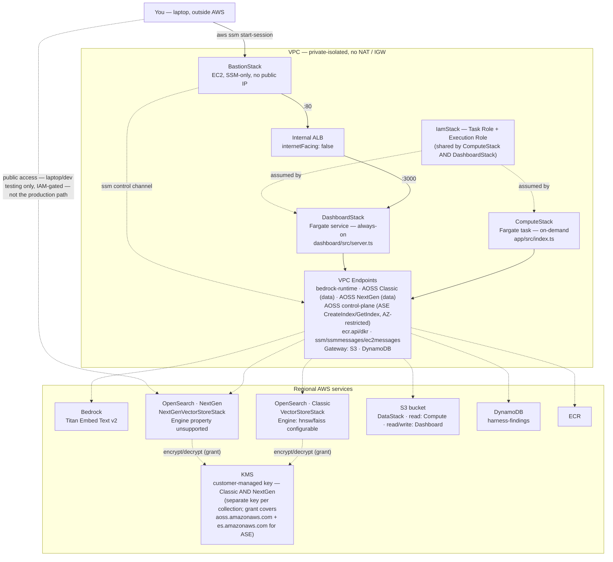

# System map: three ways in, one shared spine

**Published version (visual):** https://claude.ai/code/artifact/710a3208-693a-462d-b303-cec7deec7496

How the 8 CDK stacks actually connect: an on-demand batch run, a browser session reached through
a bastion, and a laptop-direct path used only for testing the NextGen collection.

## Three access paths

1. **On-demand connector run** — `ComputeStack`'s Fargate task, invoked manually via
   `aws ecs run-task`, not a standing service. Reads S3/DynamoDB, embeds via Bedrock, writes to
   the Classic OpenSearch collection.
2. **Browser → dashboard** — `You (laptop)` → `aws ssm start-session` → `BastionStack` (SSM-only
   EC2, no public IP) → `:80` → `Internal ALB` (`internetFacing: false`) → `:3000` →
   `DashboardStack`'s Fargate *service* (always-on, unlike ComputeStack). The dashboard queries
   Classic and NextGen side by side across four modes: keyword (BM25), vector (k-NN, Bedrock),
   hybrid, and ASE (AOSS-managed sparse, no Bedrock call).
3. **Laptop → NextGen direct** — a leftover from when `NextGenVectorStoreStack` was a standalone
   laptop-testing stack: the NextGen collection is *also* reachable publicly (IAM-gated), not
   just through the VPC. Not the production path.

## Stack dependency / mechanism map (mermaid)

## Three things this map makes obvious that the prose doesn't

- **One role, two very different lifetimes.** `ComputeStack` and `DashboardStack` assume the
  exact same `IamStack` task role, but one is an ephemeral batch job and the other is a standing
  service behind a load balancer — the shared identity is easy to miss reading the stacks in
  isolation.
- **KMS parity is new, and ASE is why.** Both collections now carry their own customer-managed
  key (NextGen switched off `AWSOwnedKey: true` when ASE landed) with an identical two-principal
  grant — `aoss.amazonaws.com` for ordinary data-plane encryption, plus `es.amazonaws.com`
  specifically because ASE's ML pipeline runs on that underlying service. That second principal,
  and the third AOSS control-plane VPC endpoint above, only exist because of ASE — neither was
  needed when this map had just dense k-NN search.
- **There are two ways to reach the dashboard's data, not one.** The production path is
  laptop → SSM → bastion → internal ALB → dashboard. The NextGen collection is *also* reachable
  directly and publicly (IAM-gated) — a leftover from when it was a standalone laptop-testing
  stack, now living alongside the VPC-only production path.

## Stack list (8 total)

| Stack | Purpose |
|---|---|
| `IamStack` | Task/execution roles, connector + dashboard CloudWatch log groups |
| `NetworkStack` | Private VPC, both AOSS generations' data-plane endpoints + a third AOSS control-plane endpoint (ASE), S3/DynamoDB gateways, SSM endpoints |
| `VectorStoreStack` | Classic OpenSearch Serverless collection |
| `DataStack` | S3 bucket + DynamoDB table (`harness-findings`) |
| `ComputeStack` | On-demand Fargate connector task |
| `NextGenVectorStoreStack` | NextGen OpenSearch Serverless collection |
| `DashboardStack` | Always-on Fargate service — Classic vs NextGen eval UI, behind internal ALB |
| `BastionStack` | SSM-only EC2 instance for reaching the private dashboard |
